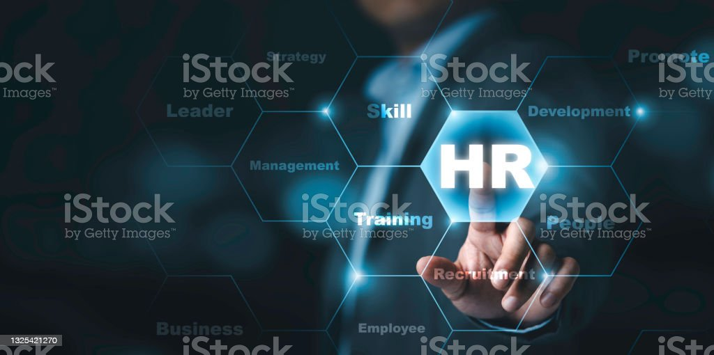

# HR Analysis

The employee deal is about more than pay and rewards. 

## Introduction:

The HR department requires visual representations to analyse attrition rates based on employees.
In this project we will see attrition rate by gander for different age groups.
This makes it challenging to identify any age and gender related attrition trends,
Preventing the organization from implementing targeted retention strategies for specific employee segment.
